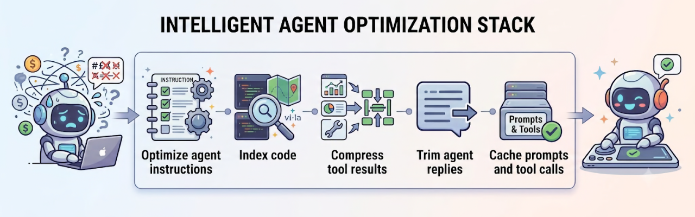

# AI Context Ops

**Cut your AI coding costs and keep your context window focused** — a curated
tool stack and agent-driven setup for Claude Code and Pi on macOS.

Every token an AI agent reads or writes fills your context window and costs
money. Left unchecked, sessions bloat with noisy tool output, verbose replies,
redundant file reads, and repeated symbol discovery — each one crowding out the
work that matters. This project installs and wires a set of lightweight tools
that intercept those waste streams at the layer where they originate.



---

## How it works

The stack intercepts token waste at four points in every session:

| Layer | Problem | Tools |
|---|---|---|
| **Input** | Agent reads raw file bytes and repeats symbol discovery | [LeanCTX](https://leanctx.com) (AST maps), Serena (LSP search), stubs (stable context files) |
| **Tool results** | MCP and CLI output floods the context window | [Headroom](https://headroom-docs.vercel.app) (compresses tool outputs, DB results, file reads), [RTK](https://www.rtk-ai.app/) / [pi-hypa](https://github.com/Hypabolic/Hypa#readme) (filters CLI output) |
| **Agent replies** | Agent responds with more words than the task needs | [caveman](https://github.com/JuliusBrussee/caveman) (verbosity suppression) |
| **Cache** | Dynamic prefixes break provider-side prompt caching | Headroom durable hooks (keep prefix stable between turns) |

All tools are passive once installed. One exception: run `headroom learn --apply`
after significant debugging sessions to update the compression model.

---

## Quick setup

Paste this into your agent (Claude Code or Pi):

```
Read https://raw.githubusercontent.com/TravisCarden/ai-context-ops/main/setup.md and follow it.
```

Or from a local clone, open [`setup.md`](setup.md) and prompt your agent to read
and follow it.

The setup prompt detects what you already have, shows you the full install plan,
asks once for consent, and skips anything already present. It is safe to re-run.

---

## Measuring effectiveness

After you've been using the stack for a while, run this in a fresh session to
see how much each layer is saving and surface any configuration issues:

```
Read https://raw.githubusercontent.com/TravisCarden/ai-context-ops/main/diagnose.md and follow it.
```

---

## Repo layout

| Path | What it is |
|---|---|
| [`setup.md`](setup.md) | **Start here** — the setup prompt you give your agent |
| [`diagnose.md`](diagnose.md) | Measures token savings; helps debug the stack post-setup |
| [`harnesses/`](harnesses/) | Per-agent setup steps called by [`setup.md`](setup.md) |
| [`stubs/`](stubs/) | Starter templates for global and per-project context files |
